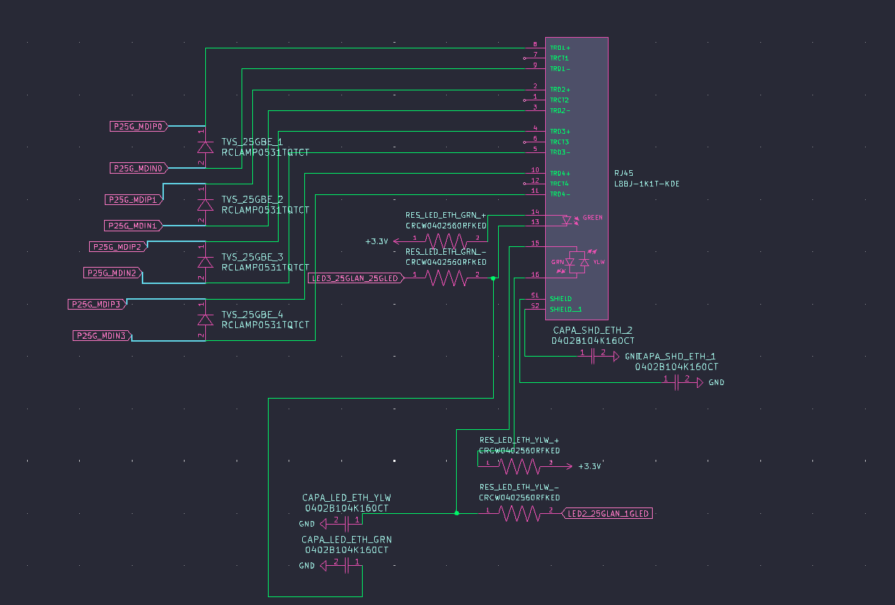
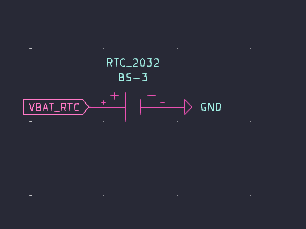
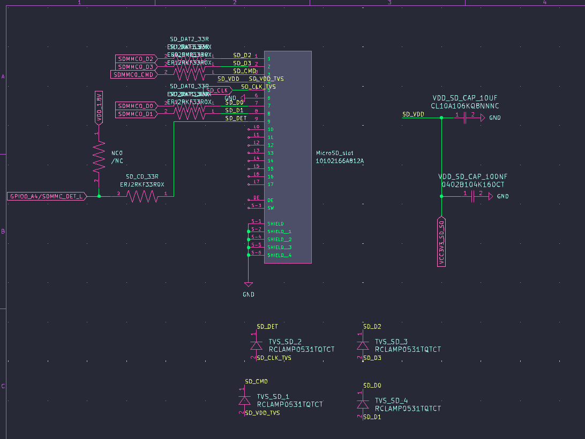
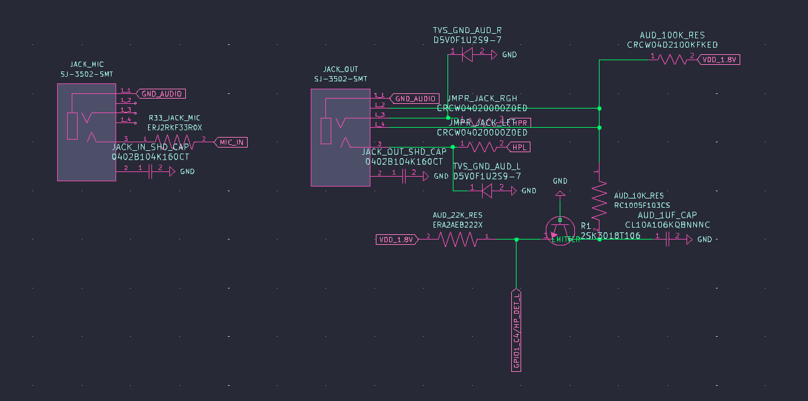

# July 21: The big start
Hello again! I know i said in application form my next project would be AR glasses but i got a different idea! What if i made a motherboard? But heres the problem, any desktop-like motherboards are veeeery hard to design and especially build! Then theres costs of parts which will definetely exceed 350$, VRM needing to handle 300+W of power (which if i do wrong can be dangerous both to parts AND to me and other devices on by electrical network!). So i decided i will use ARM processor. First i checked RPi5 processor, buuut they dont sell it to detalical user :<. So i checked processors with similiar power to it and found Rockchip RK3588! Problem? Yup, they dont sell them too, at least not the bare CPU. Only in bulk and only to companies (And i dont need 1000 CPUs! And i dont have a company!). So i found the FriendlyElec's CM3588 Plus, it is the next best thing i can get. It is basically NAS kit - you get the CPU board with ram already on it and get a NAS carrier board, buuuut you dont need to pay and get carrier board! And they are super user friendly, having their's schematics and pinout layout on theirs wiki! So i thought: "What if i madde carrier board instead? I dont need to pay for BGA soldering and i dont need to pay for 1000 processors at the time! So right now, lets stop talking and get to work:

First up: plan. What i want to do and how?

Well, i want it to use the CM3588 Plus, have max configuration of avaliable ports, and have a case that looks like miniature PC case with 2 fans - one intake and one exhaust.

So lets make a prototype BOM:
- FriendlyElec CM3588 Plus (16 GB LPDDR5/64 GB eMMC) 
- 2x USB-C 3.1 gen 1 OTG + DP - but, because it is OTG combo it can work in HOST mode or DEVICE mode - the computer needs to know when to use when, so i asked ChatGPT (as i didn't know the answer) what should i do to get every possible feature out of these ports, he said i need USB3 + DP mux (to know when to use which signal), VBUS switch (to power things only when the computer is the host) and CC Logic (to know who is host and who is device), so add example of models from ChatGPT to the list
 1. 2x HD3SS460RNHR
 2. 2x FUSB302
 3. 2x TPS25942
 4. 2x Amphenol FCI 10137064-00021LF
 5. 2x PESD5V0S1UL,315
 6. 2x BLM18AG601SN1D
 7. 2x RC0603JR‑0722RL
 8. 2x GRM21BR71H104KA01L
 9. 2x C2012X7R1A106K125AC
 10. 2x GRM188R72A104KA35D
- 1x USB-A 3.1 gen 1 HOST - good news! it can go directly to port! But i can add an ESD Safety, so add it to the list:
 1. TPD4EUSB30
 2. Port Wurth Elektronik 692122030100
 3. RC0603JR‑0722RL
 4. GRM21BR71H104KA01L
 5. 1x GRM188R72A104KA35D
 6. 1x C2012X7R1A106K125AC
- 2x USB-A 2.0 HOST - The same goes for these ports!
 1. 2x TPD4EUSB30
 2. 2x Port GCT USB1055-GF-L-A
 3. 2x RC0603JR‑0722RL
 4. GRM21BR71H104KA01L
 5. 2x GRM188R72A104KA35D
 6. 2x C2012X7R1A106K125AC
- MicroSD port - it supports up to SDR104 mode, which is great! (i think), i just need port, but i can add ESD for protection
 1. USBLC6
 2. Hirose Connector DM3AT-SF-PEJM5(41)
 3. RC0603JR‑0722RL
 4. RC0603JR‑0710KL
 5. RC0402JR‑0750RL
 6. 4x RMCF0402FT47K0
 7. 1x GRM188R72A104KA35D
 8. 1x C2012X7R1A106K125AC
- 2x HDMI 2.1 output portsA- one can display up to 8K60 and second one up to 4K60 - i dont need anything other than HDMI Type A ports, but i can add protection!
 1. 2x HDMIULC6
 2. 2x TE Connectivity 2485396-1
 3. 2x BLM18AG601SN1D
 4. 2x PESD5V0S1BA
 5. 8x PESD5V0S1UL
 6. 2x RC0603JR‑0722RL
 7. 6x GRM21BR71H104KA01L
 8. 2x GRM155R71H512KA01D
 9. 2x RG3216P-5101-D-T5 (5.1k)
 10. 2x C2012X7R1A106K125AC
 11. 2x RC0402JR‑0750RL
- 1x HDMI input up to 4Kp60 - i can add just HDMI type A port, but i can add protection!
 1. HDMIULC6
 2. TE Connectivity 2485396-1
 3. BLM18AG601SN1D
 4. PESD5V0S1BA
 5. 4x PESD5V0S1UL
 6. RC0402JR‑0750RL
 7. 3x GRM21BR71H104KA01L
 8. 2x GRM155R71H512KA01D
 9. RG3216P-5101-D-T5 (5.1k)
 10. C2012X7R1A106K125AC
- I wont add MIPI interfaces, cause i dont have anything to test them with, but i will add the audio ports it supports! We have the stereo headphone output (20mW/CH, THD+N <= -80dB, 160Ohm Load) and single-end microphone input, i will add them seperately instead of combo-jack! So we need to add DC blocking capacitor for headset audio, and we can add - you guessed it - protection! Also we need AC coupling capacitor for microphone audio
 1. EEU-FR1E101B
 2. GRM188R71C105KA12D
 3. USBLC6-2SC6
 4. ACJM-3501-SM-2 (mic)
 5. SJ1-3533N (stereo)
 6. 2x RC0603JR‑0722RL
 7. 2x BLM18AG601SN1D
 8. 1x GRM188R72A104KA35D
- Now behold: THE PCIE LANES! there are couple avaliable configuration that pcie can run in, but i want to use the one that gives 1x PCIe Gen 3 x4 and 2x PCIe Gen 2.1 x1, the gen 3 one will be as M.2 drive slot, the PCIe Gen 2.1 x1 will be avaliable as slots, it will be probably the most difficult thing to do, due to needing precise trace lenghts and controlled impendations
 1. TE Connectivity 2199119-3
 2. 2x Molex 87715-9002
 3. 3x PESD5V0S1UL
 4. 3x MF-MSMF050-2
 5. 3x BLM18AG601SN1D
 6. 5x GRM21BR71H104KA01L
 7. TUSB1002RGER
 9. 3x C2012X7R1A106K125AC
 10. 3x GRM188R72A104KA35D
- And last but not least: Ethernet RJ45 2.5 Gb/s port! CM3588 Plus was built for NAS purposes with their NAS carier board, so we can use the on-board Realtek RTL8125B
 1. Pulse Electronics JT4-2504CHL
 2. 2x PESD4ETH1G-T
 3. RC0402JR‑070RL
 4. GRM21BR71C105KA01L
 5. GRM188R72A104KA35D
- Also - UART debugging
 1. FTSH‑105‑01‑L‑DV‑K

I am like 3.5 hours into making this BOM and i am still researching everything i need to add between ports and pins

okay! i made it, full prototype BOM! it has theoretically all the parts that i need (i fricking hope so). i will make the schematics etc tomorrow. rn i am going to rest from this abomination XD

## Time spent this session: 4 hours

# July 22: Making PCB (hopefully)
I remembered i can use official NAS Kit schematic files to get information about what ports need!
First ill plan out exactly what i need and what it is for USB 3.1 gen 1 (so basically USB 3.0) type C with the DP1.4 support based on the NAS Kit schematic:
1. 4x 10uF/10V capacitor (C2012X7R1A106K125AC)
2. 3x 1uF/10V capacitor (GRM155C71A105KE11D)
3. 2x 220pF/50V capacitor (GRM1885C1H221JA01J)
4. 2x 2.2K/NC resistor (RC0603FR-072K2L)
5. TVS Diode (PESD5V0S1UL,315)
6. FUSB302 (USB/DP controller)
7. 4.7K resistor (RC0603FR-074K7L)
8. 0 resistor/jumper (RC0603JR-070RL)
9. 100nF/16V (GCM188R71C104KA37J)
10. Power Distribution Switch (TPS25942ARVCR)
11. USB-C Port (Amphenol FCI 10137064-00021LF)
12. Specific diode (Vrwm=5V, Vbr=5.6min, Ipp=10A, ESD=30KV, Ppp=85W)

It is for one port, so i will need 2x that

Then for hdmi outputs should be something alongside this:
1. 8x 499 resistors
2. 4x 10k resistors
3. 1k resistor
4. 3x 1.8k resistors
5. 2x 27k resistor
6. 4x 2SK3018W MOSFETs
7. 2x Specific diode (LRB521S-30T1G)
8. 6x Specific diodes (Vrwm=5V, Vbr=5.6min, Ipp=10A, 20pF, ESD=30KV, Ppp=85W)
9. WNM6002-3/TR Transistors
10. 2x ESD73034D
11. 4x TVS Diode

Rest of it i will do when i get home cause i need to go right now!

## Time spent this session: 1.5 hours

# July 23: PCB Making (more hopefully)
Yo, so i made basically 1 day break (from ending yesterdays session to starting this one, its 8:46 PM rn and i ended about 3:30 PM yesterday) and now i am ready to do this.

One more thing: the things i will make can look like a copy from original NAS Kit, it is because it is very hard and almost impossible to make it enitrely your own, most of this things are required in every case of making something (pull up resistors, pull down resistors, TVS diodes, capacitors etc) and for me it is more about learning all of this stuff, i learned a lot already (i always thought it was just simple as making route from port's pin to chipset's/cpu's pin and calling it a day, eventually adding some protection for things like usb killers) and i am trying to make it as much "mine" as i can, but sometimes it is not possible.

Okay, so next up we have... let me check schematics: HDMI INPUT!!! It shouldn't be this much different from the inputs!

So for input we need:
1. 2x 1k resistor
2. 5x 10k resistor
3. 100k resistor
4. 20k resistor
5. 47k resistor
6. 2x 56k resistor
7. 2.2k resistor
8. MMBT3904T1G transistor
9. 3x Specific diodes (Vrwm=5V, Vbr=5.6min, Ipp=10A, 20pF, ESD=30KV, Ppp=85W)
10. AO3415A MOSFET
11. 2x Specyfic diodes (LRB521S-30T1G)
12. 3x 2SK3018W MOSFETs
13. 2x TVS Diode

Okay, and it is all from what i can see!

Now is audio:
1. 2x Specific diodes (Vrwm=5V, Vbr=5.6min, Ipp=10A, 20pF, ESD=30KV, Ppp=85W)
2. 6x 0 resistors/jumpres
3. 3x 10k resistors
4. 2.2 k resistor
5. 1uF/10V capacitor
6. 2x 100 nF/16V capacitor
7. 2SK3018W MOSFET

Then we have Ethernet:
1. 2x 100 nF/16V capacitor
2. 4x 560 radiators
3. 2x TVS Diodes

Also, theres microSD Socket:
1. 6x 33 resistors
2. 10uF/6.3V capacitor
3. 100nF/16V capacitor
4. 2x TVS Diodes

Then the USB-A 3.0 port:
1. 10uF/10V capacitor
2. 2x 22uF/10V capacitors
3. 4.7k resistor
4. 100k resistor
5. jumper
6. Specific diode (Vrwm=5V, Vbr=5.6min, Ipp=10A, 20pF, ESD=30KV, Ppp=85W)
7. TVS diode

Then we have the USB-A 2.0 port, which is almost the same:
1. 10uF/10V capacitor
2. 2x 22uF/10V capacitors
3. 6.8k resistor
4. 100k resistor
5. jumper
6. Specific diode (Vrwm=5V, Vbr=5.6min, Ipp=10A, 20pF, ESD=30KV, Ppp=85W)
7. TVS diode

We will get to pcie last, when we will be connecting it

So lets open KiCad! 

I added 4x 2 row 50 pin each connectors, just like cm3588 has!

Lets start with something simple (at least simpler than others) such as ethernet! *(it took me almost an hour to find ethernet port that actually supports 2.5 gig ethernet AND has footprint and symbol, and now i am looking for another one cause this one doesnt have magnetics in it)*

I found the one! it is Taoglas TMJM6002A9NL!

I will be honest: it is tiring, everytime i think i am done with a section a new error pops up. I am going to sleep right now and i will try it tommorow. Goodnight!

## Time spent this session: 1.5 hours

# July 26: Return
Hello! Its me again! I am back, it is 9 PM and i am gonna pull all nighter today cause the submission deadline is close and i want to end this by then! So i just watched a yt video called "High-Speed PCB Design Tips - Phil's Lab #25", it is somewhat helpfull! I am searching some type of course on udemy co i can understand it all better!

Okay, so it is 1 am july 27th, and i have few things. First of all, i wont count this time into time spent this session, for me it isnt working on a project but more of learning new things so working on myself and my knowledge. Also i was making breaks, multi tasking etc so i wouldnt feel good counting it toward the project as some time wasnt even spent on it at all.

Second of all: i watched playlist from digi-key about making carrier board for cm4, as it is very simmiliar, it is great! i recommend to watch it if you are new to this like me! (link)[https://www.youtube.com/watch?v=ypcPJC_umPQ&list=PLEBQazB0HUyRwjr761b-MLNEu8FA8WKSG]

Third of all: in about 15-30 minutes i will end my break and start watching another video for greater details, the playlist above was good about teaching me routing things in pcb editor, but i want to know more about theory and schematics so i want to research further

I ended up watching only playlist linked above, as i couldnt find other helpful videos. I am gonna turn on kicad now, wish me luck!

it is too late, i am going to sleep gng, cause i dont wanna make my parents mad that i am pulling an all nighter, but i am waking up early and will continue this entry!

okay so i couldnt fall asleep for like 45 minutes so i am back XD, time to make schematics

I schemed out ethernet!

Now, what should i do next? Maybe RTC? It should be easy!

And done! Now i think microSD socket would be nice!

Done!!! Now what? Maybe audio?

I done audio! (i think at least), there are 2 things that are theoretically not connected even though they are, so i just need to fix it later. Right now i will add images of what i did today and end this session.

## Time spent this session: 5h